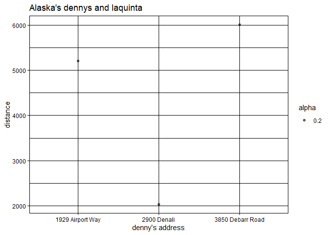
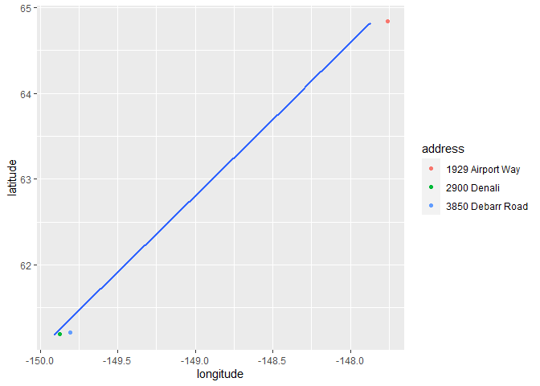
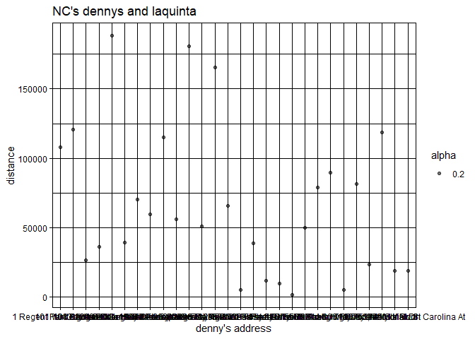
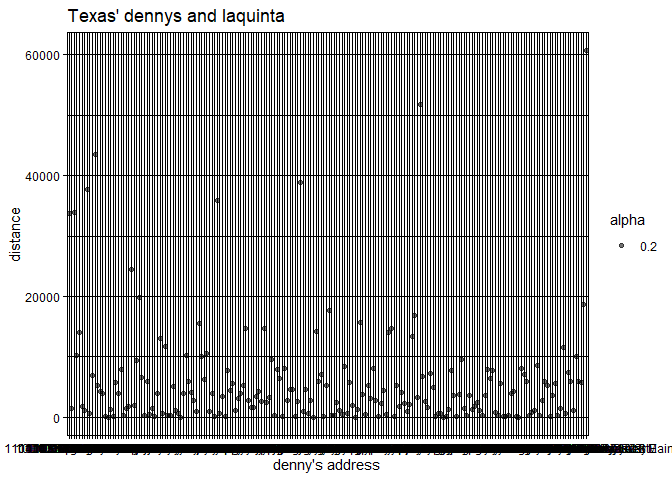
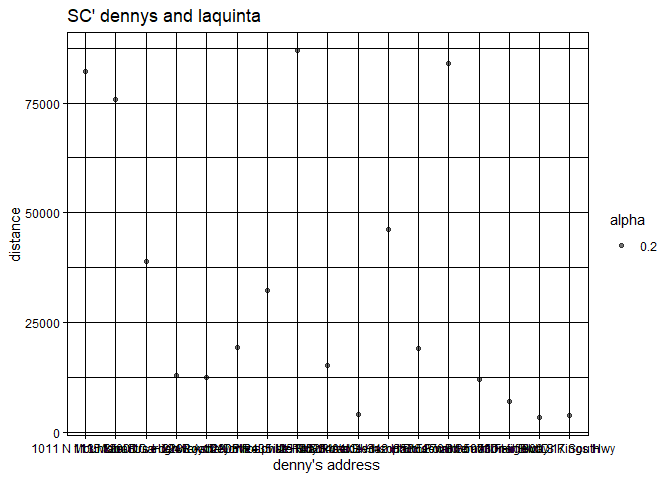

Lab 05 - Wrangling spatial data
================
Zheqi
02/10

### Load packages and data

``` r
library(tidyverse) 
library(dsbox) 
```

``` r
states <- read_csv("data/states.csv")
```

### Exercise 1

``` r
library(ggplot2)
library(dplyr)

c <- dennys
d <- laquinta
c_ak <- c %>%
  filter(state == "AK")
nrow(c_ak)
```

    ## [1] 3

``` r
# 3 locations in Alaska.
```

### Exercise 2

``` r
d_ak <- d %>%
  filter(state == "AK")
nrow(d_ak)
```

    ## [1] 2

``` r
# 2 locations in Alaska
```

### Exercise 3

…

``` r
c_d_ak <- full_join(c_ak, d_ak, by = "state")
c_d_ak
```

    ## # A tibble: 6 × 11
    ##   address.x      city.x state zip.x longi…¹ latit…² addre…³ city.y zip.y longi…⁴
    ##   <chr>          <chr>  <chr> <chr>   <dbl>   <dbl> <chr>   <chr>  <chr>   <dbl>
    ## 1 2900 Denali    Ancho… AK    99503   -150.    61.2 3501 M… "\nAn… 99503   -150.
    ## 2 2900 Denali    Ancho… AK    99503   -150.    61.2 4920 D… "\nFa… 99709   -148.
    ## 3 3850 Debarr R… Ancho… AK    99508   -150.    61.2 3501 M… "\nAn… 99503   -150.
    ## 4 3850 Debarr R… Ancho… AK    99508   -150.    61.2 4920 D… "\nFa… 99709   -148.
    ## 5 1929 Airport … Fairb… AK    99701   -148.    64.8 3501 M… "\nAn… 99503   -150.
    ## 6 1929 Airport … Fairb… AK    99701   -148.    64.8 4920 D… "\nFa… 99709   -148.
    ## # … with 1 more variable: latitude.y <dbl>, and abbreviated variable names
    ## #   ¹​longitude.x, ²​latitude.x, ³​address.y, ⁴​longitude.y

``` r
# 6
```

### Exercise 4

…

``` r
# 6 observations
#variables are address x, city x, zip x, longitude x, latitude x, address y, city y, zip y, longitude y, latitude y, and state.
```

### Exercise 5

``` r
# mutate
```

### Exercise 6

``` r
haversine <- function(longitude.x, 
                      latitude.x, 
                      longitude.y, 
                      latitude.y, round = 3) {
  # convert to radians
  longitude.x = longitude.x * pi / 180
  latitude.x  = latitude.x * pi / 180
  longitude.y = longitude.y * pi / 180
  latitude.y  = latitude.y  * pi / 180
  
  R = 6371 # Earth mean radius in km
  
  a = sin((latitude.y - latitude.x)/2)^2 + cos(latitude.x) * cos(latitude.y) * sin((longitude.y - longitude.x)/2)^2
  d = R * 2 * asin(sqrt(a))
  
  return( round(d,round) ) # distance in km
}
```

``` r
c_d_ak <- c_d_ak %>%
  mutate(dist = spatialrisk::haversine(latitude.x, longitude.x, latitude.y, longitude.y))
```

# Exercise 7

``` r
c_d_ak_mindist <- c_d_ak %>%
  group_by(address.x) %>%
  summarize(closest = min(dist))
#1374.128
```

\#Exercise 8 Describe the distribution of the distances Denny’s and the
nearest La Quinta locations in Alaska. Also include an appripriate
visualization and relevant summary statistics.

``` r
ggplot(c_d_ak_mindist, mapping = aes(x = address.x, y = closest,
                           alpha=0.2)) +
                     theme_linedraw() +
                  labs (x = "denny's address", y = "distance", title = "Alaska's dennys and laquinta", color = "laquinta's address") + geom_point()
```

<!-- -->

``` r
ggplot() +
    layer(
        data = c_ak, mapping = aes(x = longitude, y = latitude, color = address),
        geom = "point", stat = "identity", position = "identity") +
    layer(
        data = d_ak, mapping = aes(x = longitude, y = latitude),
        geom = "smooth", position = "identity", stat = "smooth", params = list(method = "lm")) 
```

    ## `geom_smooth()` using formula = 'y ~ x'

    ## Warning in qt((1 - level)/2, df): NaNs produced

<!-- -->

\#Exercise 9

``` r
c <- dennys
d <- laquinta
c_nc <- c %>%
  filter(state == "NC")
d_nc <- d %>%
  filter(state == "NC")
c_d_nc <- full_join(c_nc, d_nc, by = "state")

c_d_nc <- c_d_nc %>%
  mutate(dist = spatialrisk::haversine(latitude.x, longitude.x, latitude.y, longitude.y))
c_d_nc_mindist <- c_d_nc %>%
  group_by(address.x) %>%
  summarize(closest = min(dist))
ggplot(c_d_nc_mindist, mapping = aes(x = address.x, y = closest,
                           alpha=0.2)) +
                     theme_linedraw() +
                  labs (x = "denny's address", y = "distance", title = "NC's dennys and laquinta", color = "laquinta's address") + geom_point()
```

<!-- --> \#Exercise 10

``` r
c <- dennys
d <- laquinta
c_tx <- c %>%
  filter(state == "TX")
d_tx <- d %>%
  filter(state == "TX")
c_d_tx <- full_join(c_tx, d_tx, by = "state")

c_d_tx <- c_d_tx %>%
  mutate(dist = spatialrisk::haversine(latitude.x, longitude.x, latitude.y, longitude.y))
c_d_tx_mindist <- c_d_tx %>%
  group_by(address.x) %>%
  summarize(closest = min(dist))
ggplot(c_d_tx_mindist, mapping = aes(x = address.x, y = closest,
                           alpha=0.2)) +
                     theme_linedraw() +
                  labs (x = "denny's address", y = "distance", title = "Texas' dennys and laquinta", color = "laquinta's address") + geom_point()
```

<!-- --> \#Exercise 11

``` r
c <- dennys
d <- laquinta
c_sc <- c %>%
  filter(state == "SC")
d_sc <- d %>%
  filter(state == "SC")
c_d_sc <- full_join(c_sc, d_sc, by = "state")

c_d_sc <- c_d_sc %>%
  mutate(dist = spatialrisk::haversine(latitude.x, longitude.x, latitude.y, longitude.y))
c_d_sc_mindist <- c_d_sc %>%
  group_by(address.x) %>%
  summarize(closest = min(dist))
ggplot(c_d_sc_mindist, mapping = aes(x = address.x, y = closest,
                           alpha=0.2)) +
                     theme_linedraw() +
                  labs (x = "denny's address", y = "distance", title = "SC' dennys and laquinta", color = "laquinta's address") + geom_point()
```

<!-- -->

\#Exercise 12

``` r
# It is mostly true for Texas based on the plots. Most of the dennys locate within 10,000m from laquintas. It is also true for Alaska, but there are only a few of dennys and laquintas in Alaska. 
```
